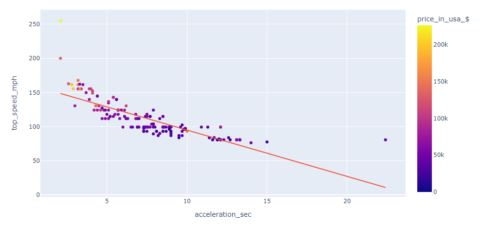
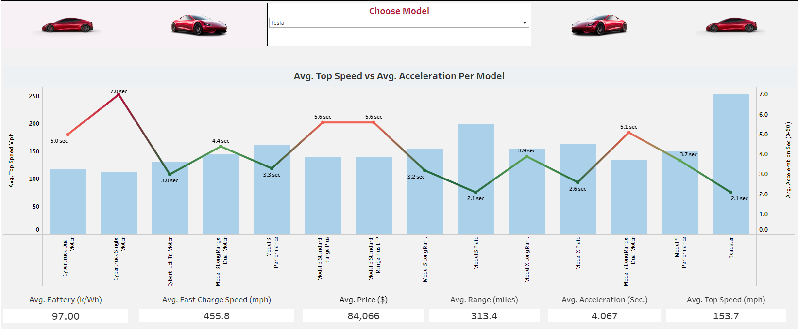
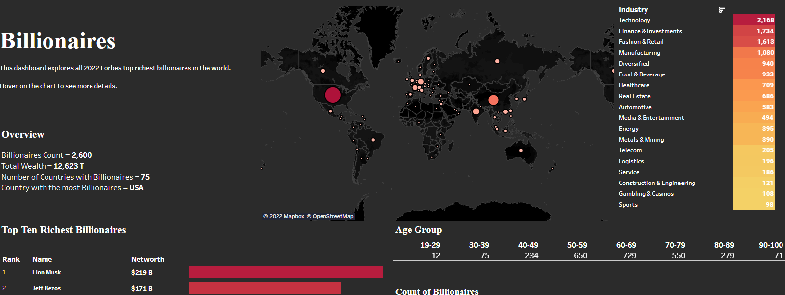

# Data Analysis Portfolio

## [Project 1: EV Dataset Analysis](https://github.com/leon-arie/leon-arie.github.io/blob/main/EV%20Analysis.ipynb)

### Purpose: 
In this project, I use **Python** to compare key metrics between different electric vehicles to find valuable information that will help lead to future buying decisions.
### Tasks:
1. Clean dataset to prepare for analysis.
2. Exploratory data analysis.
3. Find correlation between key metrics.
4. Analyze if higher prices determines higher performance for an EV.

## [Project 2: EV Comparison Tableau Dashboard](https://public.tableau.com/app/profile/leon.arie/viz/EVDashboard_16550801177210/CarDashboard) 

### Purpose: 
In project 2, I take the cleaned dataset in project 1 and create a Tableau dashboard to **compare different car performance based on models**.  

### Tasks:
1. Load EV dataset into Tableau.
2. Create bar graphs and tables to compare performance metrics.
4. Add a filter function for each car model to quickly view EV stats.

## [Project 3: Forbes 2022 Billionaires Tableau Dashboard](https://public.tableau.com/app/profile/leon.arie/viz/Billionaires_16552642324310/Dashboard1) 

### Purpose:
Analyze demographic information on the top Forbes 2022 billionaires around the world and create an interactive Tableau dashboard.

### Tasks:
1. Clean dataset and load it into Tableau.
3. Create a Tableau dashboard with different demographic data to further analyze the top billionaires.
